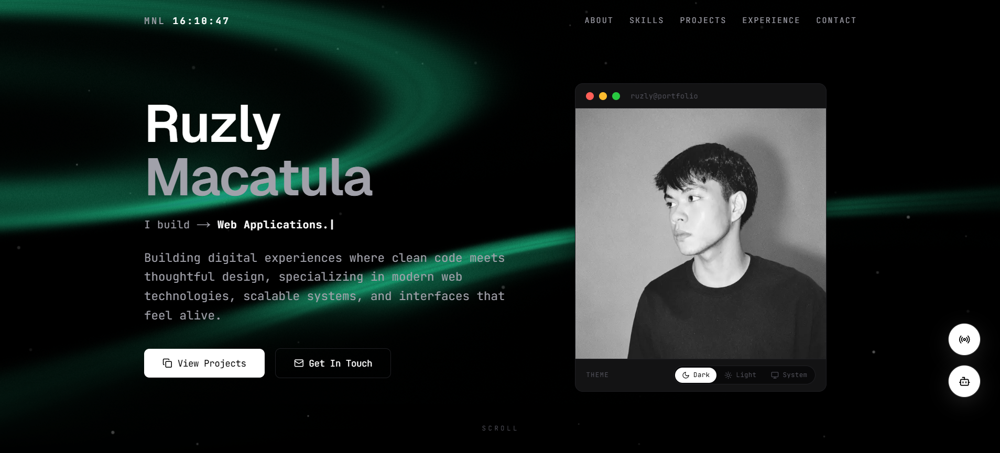

# Ruzly Portfolio

My personal portfolio website 

**Live:** [macatula-ruzly.vercel.app](https://macatula-ruzly.vercel.app)

## What's inside

- **Terminal hero** — a macOS-style terminal that animates through commands.
- **ASCII globe** — a rotating globe rendered entirely in ASCII characters.
- **Chatbot** — a chat widget framed inside a MacBook mockup.
- **Community chat** — a public chat with avatars
- **Projects** — featured works like NoteChat, ResearchAI, and PipWise.
- **Widgets** — a music and sports radio player, scrolling marquee, and animated dot field.
- Fully responsive across desktop and mobile.

## Contact

GitHub: [@yslruzly](https://github.com/yslruzly)
