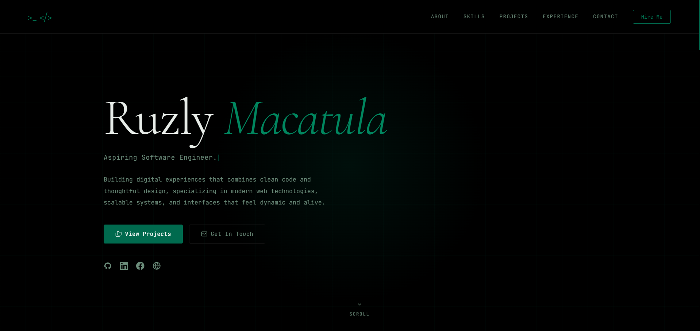

# Ruzly Portfolio

My personal portfolio site — a developer portfolio with a macOS-style terminal hero, an ASCII globe, an embedded chatbot, and a few interactive widgets. Built with Next.js 15 and the App Router.

**Live:** [macatula-ruzly.vercel.app]



## Features

- **Terminal hero** — a macOS-style terminal that greets visitors and animates through commands.
- **ASCII globe** — a rotating globe rendered in ASCII, with a land mask driving the geometry.
- **Interactive chatbot** — a chat widget framed inside a MacBook mockup, with separate layouts tuned for desktop and mobile.
- **Skill pills** — Devicon-based tech icons that light up in their brand colors on hover.
- **Projects section** — featured work (NoteChat, ResearchAI, ArchiBoardPH, and more) with a show/hide toggle to keep the list tidy.
- **Ambient widgets** — a radio player, a marquee, and an animated dot field for texture.
- **Campus preview** — a nod to UE Manila.
- **JetBrains Mono** set as the global font for a coder feel.
- Fully responsive across desktop and mobile.

## Tech Stack

- [Next.js 15](https://nextjs.org/) (App Router)
- [React 19](https://react.dev/)
- [TypeScript](https://www.typescriptlang.org/)
- [Tailwind CSS v4](https://tailwindcss.com/)
- Deployed on [Vercel](https://vercel.com/)

## Getting Started

Clone the repo and install dependencies:

```bash
git clone https://github.com/yslruzly/portfolio-v2.git
cd portfolio-v2
npm install
```

Run the dev server:

```bash
npm run dev
```

Open [http://localhost:3000](http://localhost:3000) to view it.

### Environment variables

If the chatbot calls an external AI API, add its key to a `.env.local` file in the project root:

```bash
# .env.local
YOUR_API_KEY=your_key_here
```

`.env.local` is gitignored, so it stays out of the repo. When you deploy, add the same variables in your Vercel project's Environment Variables settings.

## Project Structure

```
app/                    # App Router entry — layout, page, global styles
components/             # UI components
  Hero.tsx              # Landing hero
  HeroTerminal.tsx      # macOS-style terminal
  AsciiGlobe.tsx        # ASCII-rendered globe
  ChatbotWidget.tsx     # Chat entry point
  WebMacbookChatbot.tsx # Desktop chatbot layout
  MobileMacbookChatbot.tsx # Mobile chatbot layout
  Projects.tsx          # Projects with show/hide toggle
  Skills.tsx            # Devicon skill pills
  Experience.tsx        # Experience section
  About.tsx             # About section
  Contact.tsx           # Contact section
  Nav.tsx               # Navigation
  CampusPreview.tsx     # UE Manila preview
  RadioWidget.tsx       # Radio player
  Marquee.tsx           # Scrolling marquee
  DotField.tsx          # Animated dot background
  motion-primitives.tsx # Shared animation helpers
lib/
  data.ts               # Site content and project data
  land-mask.ts          # Globe land-mask data
  tech-icons.ts         # Skill icon config
public/images/          # Screenshots, favicon, profile photo
```

## Deployment

The site deploys on Vercel. Push to `main` and Vercel rebuilds automatically. To set it up:

1. Import `portfolio-v2` from GitHub at [vercel.com/new](https://vercel.com/new).
2. Vercel auto-detects Next.js — no build config needed.
3. Add any environment variables (see above) before the first deploy.

## Contact

**John Ruzly Macatula** — Computer Science student at UE Manila.

- GitHub: [@yslruzly](https://github.com/yslruzly)

---

Built with Next.js, React, and Tailwind CSS.
